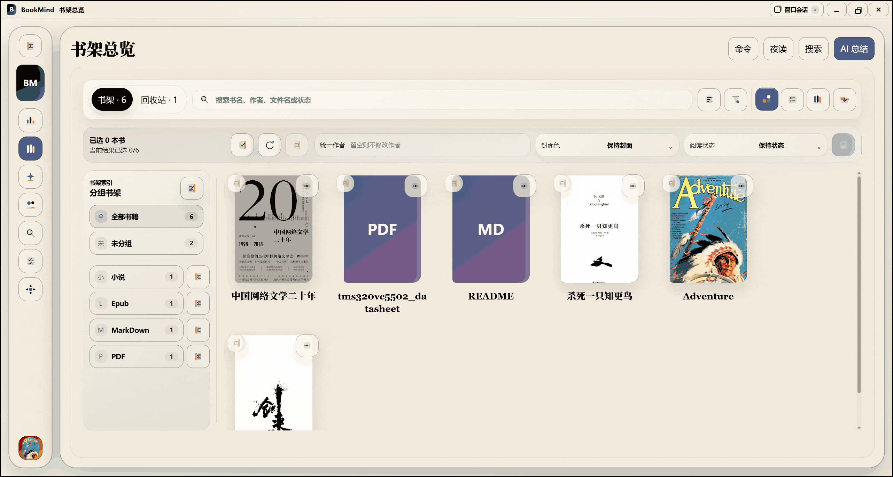
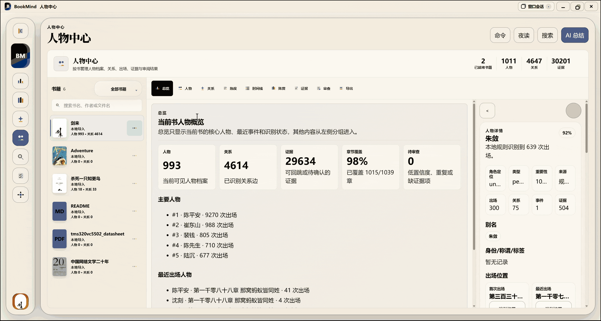
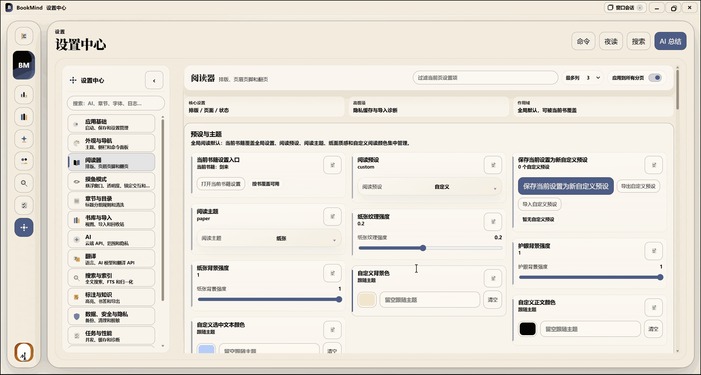

# BookMind

<p align="center">
  <strong>本地优先的桌面阅读、检索与知识整理工具</strong><br />
  在同一个安静的工作台中管理书库、阅读进度、标注、人物关系和 AI 辅助。
</p>

<p align="center">
  
  
  
  
</p>

> [!IMPORTANT]
> 本仓库不分发书籍、索引或用户数据。请仅导入你拥有合法使用权的内容。

English documentation: [docs/README.en.md](docs/README.en.md)

## 预览

### 书库与导入

<p align="center">
  
</p>

### 沉浸阅读

<p align="center">
  
</p>

### 搜索与人物关系

<p align="center">
  
</p>

### AI 阅读助手

<p align="center">
  
</p>

### 知识库与任务中心

<p align="center">
  
</p>

### 设置与数据维护

<p align="center">
  
</p>

## 功能

### 书库与阅读

- 导入单个文件或整个目录，支持 TXT、Markdown、EPUB、PDF、MOBI 等本地阅读格式。
- 自动识别 UTF-8、UTF-16、GB18030/GBK 等常见中文文本编码。
- 提供流式与分页阅读、单双页布局、目录、阅读位置恢复、书签和阅读外观预设。
- 支持独立阅读窗口、字体与版式调整、夜间主题、焦点阅读和快捷键。
- 支持高亮、批注、摘录与书签；标注可导出为 Markdown、CSV、Anki CSV、Obsidian、Logseq 或 Readwise 格式。

### 检索与知识整理

- 基于本地 SQLite FTS5 的全文检索，可在书内、全库、章节、标注和书签范围中搜索。
- 支持大小写、模糊、正则、全半角、繁简转换及拼音首字母匹配。
- 提供人物档案、关系图谱、出场统计、证据定位和角色审阅。
- 将笔记、高亮和 AI 结果沉淀到知识页，并可由高亮生成闪卡或导出知识库。

### AI 与任务

- 本地索引驱动的问答与引用定位，回答可直接跳回原文位置。
- 可将 AI 回答保存为笔记、将引用保存为高亮，并生成闪卡、时间线和人物关系等结构化结果。
- 可选接入兼容 OpenAI API 的模型服务；密钥由本机安全存储管理，不写入仓库。
- 导入、解析、索引与人物抽取均通过任务中心运行，支持查看进度、暂停、继续、重试和取消。
- 提供隐私控制、请求历史、脱敏诊断导出、数据备份及本地数据密钥轮换。

## 隐私与数据

BookMind 默认在本地保存书籍、索引、阅读记录、标注和知识数据。只有在你主动配置云端 AI 或翻译服务后，相关内容才会发送至对应服务。

使用云端服务前，请确认其隐私政策符合你的要求；分享诊断信息前，请检查其中是否包含不应公开的书籍内容或路径。

## 快速开始

### 环境要求

- Node.js 22 或更高版本
- Rust stable 工具链
- Windows：Microsoft C++ Build Tools 与 WebView2 Runtime
- macOS：Xcode Command Line Tools
- Linux：WebKitGTK、GTK、OpenSSL 等桌面构建依赖。Ubuntu 可安装 `libwebkit2gtk-4.1-dev build-essential libssl-dev libayatana-appindicator3-dev librsvg2-dev`

### 开发运行

取得源码后，在仓库根目录执行：

```powershell
cd apps\desktop
npm ci
npm run tauri:dev
```

启动后，从书库页导入本地文件或目录即可开始使用。

### 界面语言

设置中心支持跟随系统，以及简体中文、English、日本語、Español、Français 和 한국어。选择“跟随系统”时，BookMind 会根据操作系统语言自动选择对应界面；未匹配的系统语言默认使用简体中文。所有支持的语言均覆盖完整消息键集。

## 构建

仅构建前端：

```powershell
cd apps\desktop
npm run build
```

构建当前系统的原生安装包：

```powershell
cd apps\desktop
npm run tauri:build
```

构建产物通常位于 `apps/desktop/src-tauri/target/release/bundle/`。Windows 生成 MSI/NSIS，macOS 生成 `.app`/`.dmg`，Linux 生成适用于当前发行版的安装包。跨平台发行应在相应系统的 CI runner 上构建；仓库已提供 Windows、macOS 和 Linux 构建矩阵。

## 验证

在 `apps/desktop` 下执行：

```powershell
npm run build
npm run test:reader-model
npm run test:ai-research-contracts

cd src-tauri
cargo check --all-targets
```

完整验证可运行 `npm test`。该命令包含工作区改动基线守卫；若已有本地改动，请先按守卫提示记录基线。

## 项目结构

```text
apps/
  desktop/
    src/                 React + TypeScript 应用
    src-tauri/           Rust/Tauri 原生层、数据层与任务执行器
    scripts/             可执行的代码契约与验证脚本
    src/tests/fixtures/  脱敏的测试响应样本
assets/
  demo/                  README 演示素材
```

## 贡献

欢迎提交 issue 和 pull request。完整要求见 [CONTRIBUTING.md](CONTRIBUTING.md)。提交前请确保：

1. 不提交书籍正文、数据库、索引、密钥、账号信息或机器路径。
2. 为新增或变更的行为补充相应测试或契约验证。
3. 运行与改动范围相对应的前端和 Rust 验证命令。
4. 不将云端服务凭据、个人 API 地址或私人阅读数据写入测试样本。

## 路线

请以当前代码和发行说明为准，未完成的能力不构成可用承诺。

## 许可

本项目采用 [Apache License 2.0](LICENSE)。

安全问题请参阅 [SECURITY.md](SECURITY.md)，不要在公开 issue 中披露漏洞或敏感数据。
